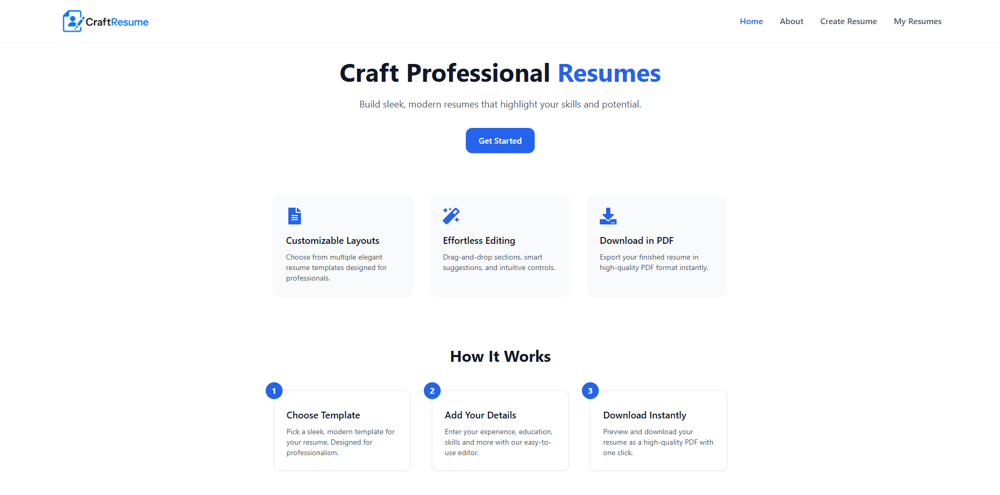
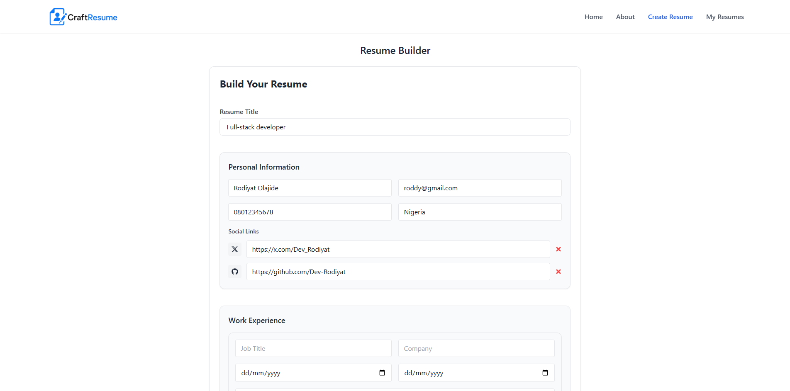
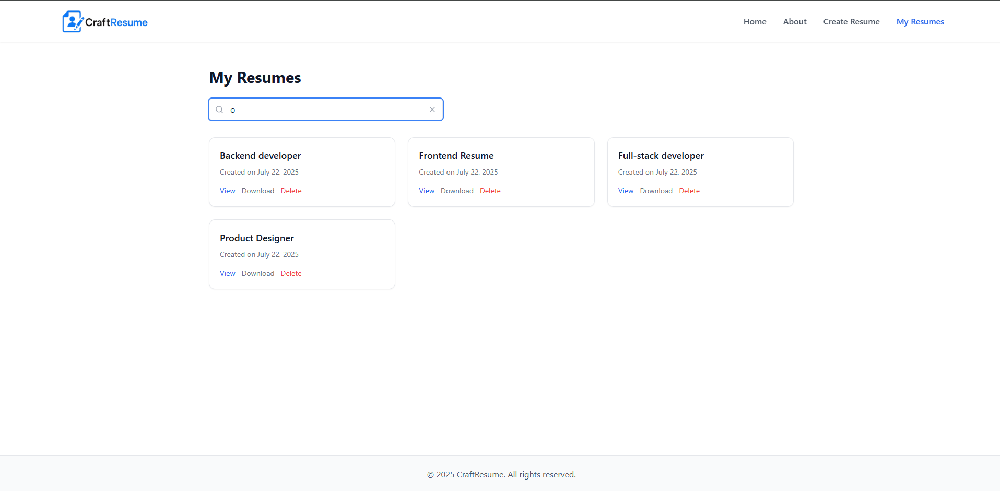
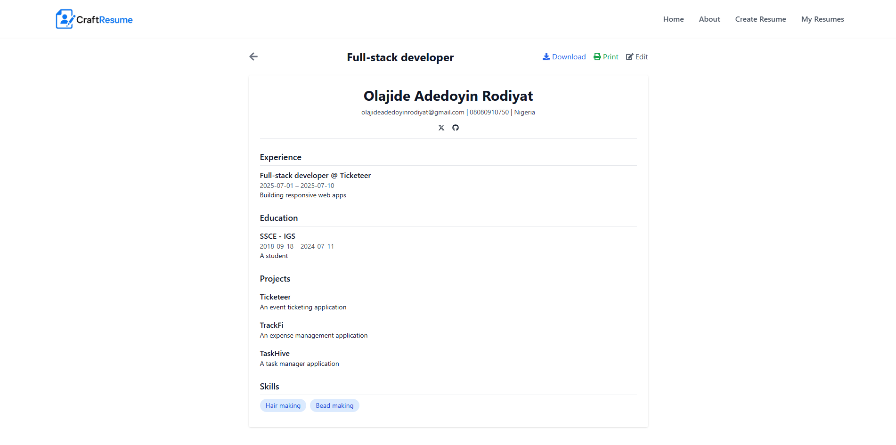

# 📝 CraftResume

CraftResume is a sleek, modern resume builder that helps users easily create, edit, and save professional resumes right from their browser. Designed with simplicity and efficiency in mind, it offers a smooth user experience for job seekers, students, and professionals alike.

## With CraftResume, users can:

- 🛠️ Build resumes section by section — including personal info, experience, education, skills, certifications, and projects.
- 💾 Save multiple resumes locally for easy access and management.
- 📝 Edit existing resumes at any time.
- 🔍 Search and filter resumes by name.
- 📄 Download resumes as JSON files or print them directly from the browser.
- 🧭 Navigate with a responsive, user-friendly interface that works on all devices.

Whether you're applying for your first job or updating your resume for the next big opportunity, CraftResume provides a distraction-free and efficient platform to craft your perfect resume in minutes.


## ✨ Features

- 🏗️ Dynamic Resume Builder Form  
- 💾 Save resume drafts locally  
- 🖊️ Edit and update existing resumes  
- 📄 Organize resumes by title and date  
- 🎨 Responsive and user-friendly UI
- 🖨️ Print and download resumes

## 🔧 Tech Stack

- **React** — UI Library  
- **React Router** — Routing  
- **Framer Motion** — Animations  
- **Tailwind CSS** — Styling  
- **React Toastify** — Notifications  
- **LocalStorage** — Draft persistence

## 🚀 Getting Started

### 1. Clone the Repository

```bash
git clone https://github.com/Dev-Rodiyat/CraftResume.git
cd CraftResume
````

### 2. Install Dependencies

```bash
npm install
```

### 3. Start Development Server

```bash
npm run dev
```

The app will be available at [http://localhost:5173](http://localhost:5173)

## 📁 Folder Structure (Simplified)

```
src/
│
├── components/
│   ├── builder/                                   
│   │   ├── BuilderForm.jsx              # Main form for resume creation
│   │   ├── FormSectionWrapper.jsx       # Optional wrapper for consistent section styling
│   │   └── FormSections/
│   │       ├── PersonalInfoForm.jsx     # Form for name, email, phone, address, etc.
│   │       ├── ExperienceForm.jsx       # Inputs for work experience details
│   │       ├── EducationForm.jsx        # Fields for academic background
│   │       ├── CertificationsForm.jsx   # Input for certifications or awards
│   │       ├── ProjectsForm.jsx         # Add notable project experience
│   │       └── SkillsForm.jsx           # Add a list of professional skills
│   │
│   ├── craft/
│   │   └── ResumeList.jsx               # View and manage saved resumes
│   │
│   ├── Footer.jsx                       # App footer
│   ├── Header.jsx                       # Top navigation bar
│   ├── Layout.jsx                       # Wraps pages with header and footer
│   ├── MobileMenu.jsx                   # Mobile-friendly navigation menu
│   └── ScrollToTop.jsx                  # Scrolls to top on route changes
│
├── pages/
│   ├── Home.jsx                         # Landing page
│   ├── About.jsx                        # About the app/creator
│   ├── Builder.jsx                      # Resume builder page using BuilderForm
│   ├── MyCraft.jsx                      # Page to view saved resumes
│   └── ResumeView.jsx                   # Preview a styled resume
│
├── assets/                              # Static assets like logos and images
├── App.jsx                              # Root app component with routes/layout
└── main.jsx                             # App entry point (ReactDOM.render)


## 📸 Screenshots

 
 
 


## 📦 Future Improvements

* User authentication and cloud sync
* CV Creation
* Dark mode
* Drag-and-drop section reordering

## 🧑‍💻 Author

**Crafted by \[Rodiyat Olajide]**
Feel free to connect: [X](https://x.com/Dev_Rodiyat) · [Linkedin](https://www.linkedin.com/in/rodiyat-olajide-71b737329/)
